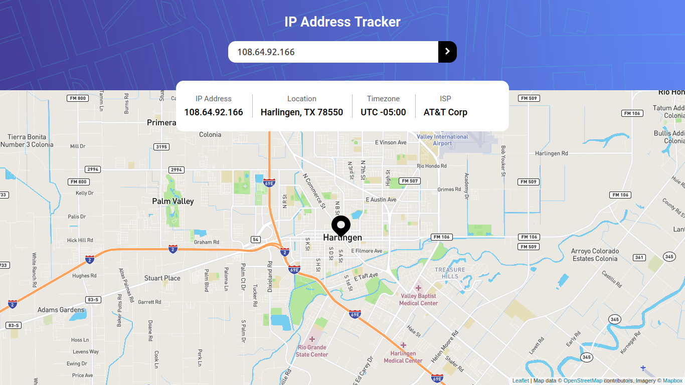
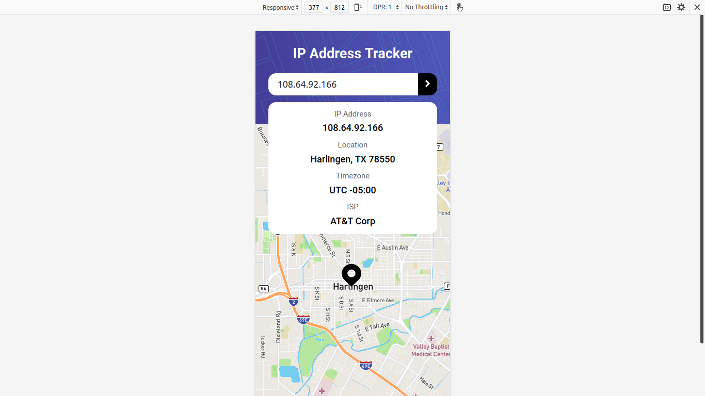

# Frontend Mentor - IP address tracker solution

This is a solution to the [IP address tracker challenge on Frontend Mentor](https://www.frontendmentor.io/challenges/ip-address-tracker-I8-0yYAH0). Frontend Mentor challenges help you improve your coding skills by building realistic projects.

## Table of contents

- [Overview](#overview)
  - [The challenge](#the-challenge)
  - [Screenshot](#screenshot)
  - [Links](#links)
- [My process](#my-process)
  - [Built with](#built-with)
  - [What I learned](#what-i-learned)
- [Author](#author)

**Note: Delete this note and update the table of contents based on what sections you keep.**

## Overview

### The challenge

Users should be able to:

- View the optimal layout for each page depending on their device's screen size
- See hover states for all interactive elements on the page
- See their own IP address on the map on the initial page load
- Search for any IP addresses or domains and see the key information and location

### Screenshot

### Links

- Github: [Github](https://github.com/hectorgarcia07/FEM-IPAddressTracker)
- GitHub Pages: [Github Pages](https://hectorgarcia07.github.io/FEM-IPAddressTracker/)

### Built with

- Semantic HTML5 markup
- CSS custom properties
- Flexbox
- Vanilla Javascript
- Mobile-first workflow

### What I learned

This is my first solution for the FrontEndMentor challenge! Decided to exercise my JS
skills and compleated this challange using pure vanilla JS.

I managed to learn a few new things related to CSS such as positioning, animation, and
accessibility design. I also managed to incorporate JS ES6 syntax.

## Author

- Website - [Hector Garcia](https://github.com/hectorgarcia07)
- Frontend Mentor - [@hectorgarcia07](https://www.frontendmentor.io/profile/hectorgarcia07)
